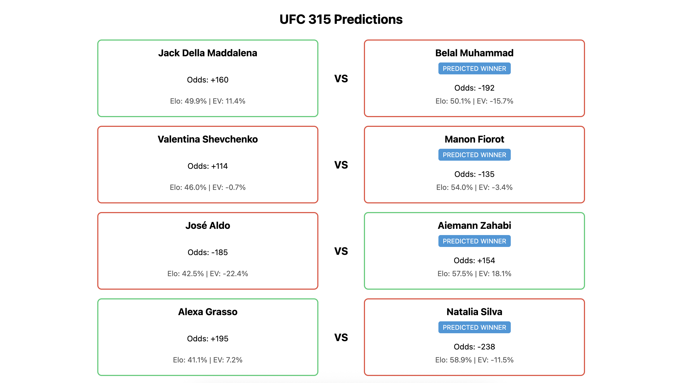

# UFC Fights EV Predictor

A simple React+TypeScript frontend showing weekly UFC fights with sportsbook odds and my Python Elo‑based win probabilities & expected value (EV). Positive‑EV fighters are highlighted in green; negative in red.

<p align="center">
  
</p>

## Features

- **Odds & implied probabilities** from UFC’s official site  
- **Elo model** built in Python 
- **Expected value (EV)** calculation & color‑coded borders  
- **“Predicted Winner”** badge under the fighter with Elo > 50%

## Tech Stack

- **Frontend:** React, TypeScript, Vite 
- **Backend:** Python
- **Data:** UFC Stats scraping, Elo engine

## Getting Started

```bash
cd frontend
npm install
npm run dev
